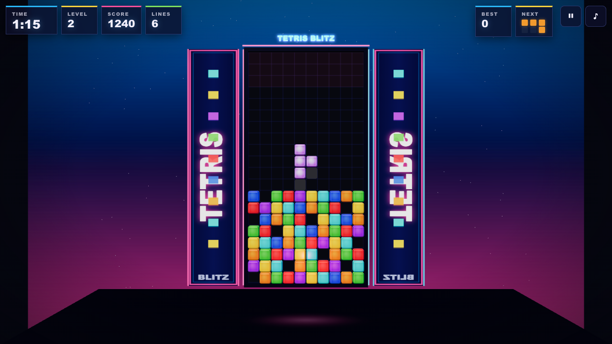
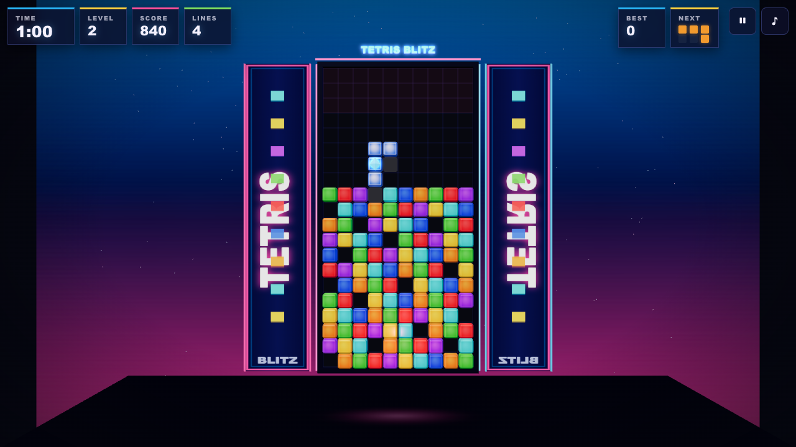
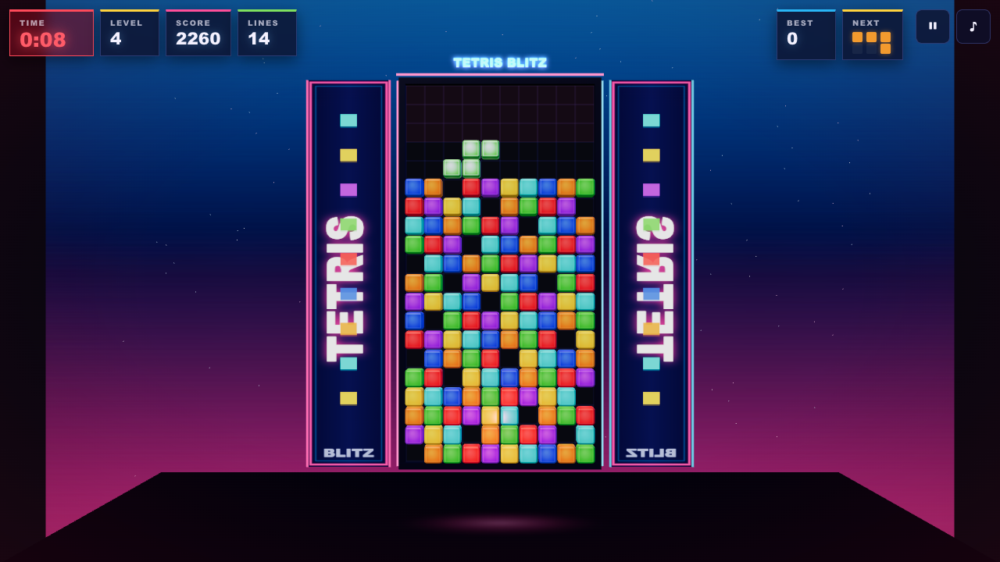

# TETRIS BLITZ · 限时道具俄罗斯方块

🕹 **[在线试玩](https://ganmino.github.io/tetris-blitz/)**（GitHub Pages，支持手机）

120 秒倒计时 + 方块随机道具的街机风俄罗斯方块。每一块落下的方块都可能藏着翻盘道具——时间耗尽前能刷多少分？







## 玩法

- ⏱ **限时冲刺**：初始 120 秒；每消 1 行 +4 秒；时间归零 → TIME UP。
- 💎 **方块道具**：约 18% 的方块带有道具（60 秒后升至 26%），道具附在方块某一格上，**方块落定即触发**：

  | 徽记 | 道具 | 效果 |
  | --- | --- | --- |
  | 🟦 +8s | 时间 +8s | 立即增加 8 秒 |
  | 🟩 SLOW | 减速 | 12 秒内下落速度大幅降低 |
  | 🟧 BOOM | 爆破清底 | 立即清除堆叠最底部 2 行 |
  | 🟨 x2 | 双倍得分 | 12 秒内得分 ×2 |
  | 🩷 +300 | 加分 | 立即 +300 分 |

- 📈 **难度曲线**：等级随耗时每 30 秒一档（LV1→LV4，下落 0.9s/格 → 0.35s/格）。
- 🔥 **连消 COMBO**：连续消行倍率 ×1 → ×1.5 → ×2 → ×2.5 → ×3，断连重置。
- 💀 **两种失败**：时间耗尽（TIME UP）或方块堆到顶（TOPPED OUT），结算画面会告诉你原因。

## 操作

| 动作 | 键盘 | 手机触屏 |
| --- | --- | --- |
| 左右移动 | ← / → | ◀ ▶ |
| 旋转（顺/逆） | ↑ / Z 与 X | ⟳ / ↺ |
| 软降 | ↓ | ▼ |
| 硬降 | 空格 | ⏬ |
| 暂停 | P / Esc | ⏸ |
| 静音 | M | ♪ |
| 开始 / 重开 | Enter / R | 按钮 |

## 本地运行

```bash
git clone https://github.com/GanMino/tetris-blitz.git
cd tetris-blitz
npm install
npm run dev        # http://127.0.0.1:5188
```

## 测试与验证

```bash
npm test                 # Playwright：视觉回归（桌面+移动）+ 机器人试玩（4 行消除剧本）
npm run inspect:canvas   # 画布检查器（像素指标 + 渲染预算 + 状态钩子截图）
npm run build            # 生产构建（输出 dist/）
npm run preview          # http://127.0.0.1:4188 预览构建产物
```

QA 证据（画布指标、状态截图、机器人报告）：`artifacts/final-evidence.md`、`artifacts/canvas-inspection/pass-3/`。

## 技术栈

- **Three.js** + **TypeScript** + **Vite**（脚手架来自 [majidmanzarpour/threejs-game-skills](https://github.com/majidmanzarpour/threejs-game-skills)）
- 全程序化美术：宝石质感方块（倒角 + 光泽贴图）、街机机柜、霓虹灯带、侧翼面板、消行粒子爆发、震屏 —— 零外部素材
- **Web Audio** 合成 8-bit 音效 + chiptune 循环背景乐（无音频文件），静音偏好持久化
- 静态堆叠按颜色 `InstancedMesh` 渲染（约 30 draw calls）；`lil-gui` 支持 `?debug` 实时调参
- 测试钩子：`window.__THREE_GAME_TEST_HOOKS__`（seed / setState / 暂停截图）+ `__THREE_GAME_DIAGNOSTICS__`

## 目录结构

```
src/
  core/     Loop · Renderer · InputController（键盘+触控统一意图，DAS 自动重复）
  game/     Game（状态机/计分/道具效果）· Board（网格/消行/压缩）· Pieces（7-bag）·
            PowerUps · BoardView（3D 场景）· constants（全部可调参数）
  systems/  Hud（DOM UI）· AudioSystem（合成音频）· DebugTools（lil-gui）
tests/      Playwright 视觉回归 + 机器人试玩
scripts/    画布检查器（inspect-threejs-canvas.mjs）
artifacts/  设计简报 · 最终证据 · 检查截图
```

## 部署

推送 `main` 分支即触发 [GitHub Actions](.github/workflows/deploy.yml) 自动构建并发布到 GitHub Pages：

- 站点：https://ganmino.github.io/tetris-blitz/
- Vite `base` 在生产构建下自动设为 `/tetris-blitz/`
